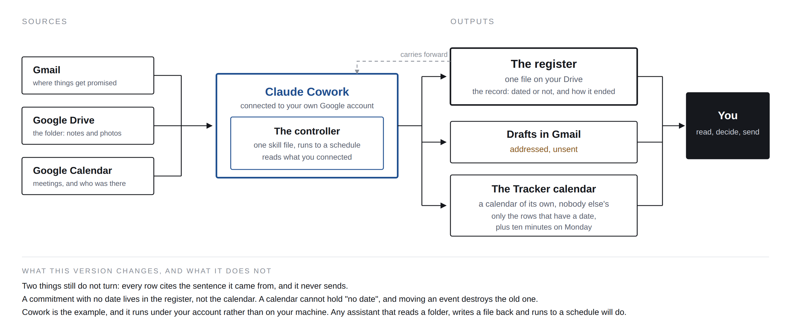

# Connect it, so you barely touch it

*Companion kit for* ***So What, Now What*** *- Issue 05.*

**This is the normal way to run it.** The folder version in [`SETUP.md`](SETUP.md) works everywhere and needs nobody's permission, which makes it the right floor - but if you are exporting mail threads into a folder every week, you will stop within a month, and you will be right to.

Connect it instead. Then the only things you do by hand are the three things no connector can see.

This is how I run mine. It is an example, not a requirement. Whatever you use needs to do three things: **read the places your commitments arrive, run to a schedule without being asked, and write a file back.** Check yours against those three.

---

## What you still do by hand, and it is only this

1. **A line after a phone call.** Who, what, by when. Twenty seconds, typed or dictated.
2. **A photograph** of a notebook page, a whiteboard, a printed agenda with scribbles.
3. **Anything said in a room** that produced no notes.

**And the controller cuts even that down.** It reads your calendar, notices the meetings and calls that produced no record anywhere, and asks you one question in the weekly digest:

> "Tuesday, 30 minutes with Ingrid, and nothing came out of it. Anything promised?"

One line back and it builds the rows. That turns a habit you have to remember into a question you only have to answer, which is the difference between a tool that survives a month and one that does not.

Everything else - mail, files, calendar - arrives without anybody doing anything.

---

## First: half of this is already in the product

Before you connect anything, open Gmail's settings and look at the **General** tab. Under **Nudges** there are two tick boxes. Google's own help page describes them like this:

> **Suggest emails to reply to:** At the top of your inbox, you can find emails that you forgot to reply to.
>
> **Suggest emails to follow up on:** At the top of your inbox, you can find sent emails that you may need to follow up on.
>
> - [Reply to messages in Gmail, Gmail Help](https://support.google.com/mail/answer/6585)

That is silence detection, in both directions, and Google shipped it in 2018. *(One documented precondition: the same page notes conversation view must be on. Check whether yours are ticked - Google's help page does not state a default.)*

**When did you last act on it?**

The detection was never the hard part. Your calendar knows the date, your inbox knows nobody replied. What is missing is that somebody has to do something about it, and doing something costs them. So what follows is not better detection. It is the register, kept current without you.

---

## What changes, and what does not

Same six steps either way. Only the first and the last are different.

| Step | Folder version | Connected version |
|---|---|---|
| 1 · Gather | Reads the working folder | Reads mail, files and calendar directly |
| 2 · Extract | Threshold, every row quoted | unchanged |
| 3 · Split | Both directions | unchanged |
| 4 · Age | On last mention | unchanged |
| 5 · Close | delivered / renegotiated / dropped | unchanged |
| 6 · Draft | One line, waiting in a file | One line, waiting in your drafts folder |

The register is still a plain file that you own. **Nothing about the object changes** - which is the point of having made the object the file rather than the tool.

---

## Setup

1. **Use a personal Google account.** Not your work one, not yet. This is the whole point of starting here: you need nobody's permission.
2. **Connect mail, file storage and calendar**, read access, plus the ability to write a file and leave a draft.
3. **Give the assistant [`controller.skill.md`](controller.skill.md)**, unchanged, plus the four lines below.
4. **Point it at your register file** on Drive, and at a working folder beside it.
5. **Make a calendar of its own.** Call it Tracker. Not your main calendar - see why below.
6. **Set it to look daily.** It will be silent most days. Pick a weekday for the digest.

### The four lines to add

> Read mail, files and calendar directly. Treat each mail thread as one piece of material, dated by its most recent message. Use the working folder for call notes, photographs and anything I drop in.
>
> A reply on a thread is a mention. An automated notification, a calendar invite acceptance and a marketing message are not.
>
> Write drafts into my drafts folder, addressed and unsent. Never send. Never reply. Never accept or create an event on any calendar but Tracker.
>
> Put dated rows on Tracker at the lead time. Rows with no date stay in the register only.

---

## Why the calendar is a view and not the record

The Tracker calendar is worth having: a dated commitment shows up on your phone without you opening anything, which is most of what "low touch" means in practice.

But the register stays the record, for two reasons that are not stylistic.

**A calendar cannot hold "no date."** Most real commitments never had one - "give me a few days", "next week or two". To put those in a calendar you would have to invent a slot, which is exactly the smoothing the controller is forbidden to do. They live in the register and are found by silence instead.

**Moving an event destroys the old date.** Renegotiation in a calendar means dragging the event to the 4th, and the 14th stops existing. The register records that a date *moved*; a calendar records only where it landed. Since "a date changed and nobody wrote it down" is the thing this whole issue is about, the record cannot be a calendar.

**And a work calendar leaks.** In most organisations colleagues see titles, and at minimum free/busy. A calendar called Tracker containing "Marek - pricing sheet, quiet 17 days" is one sharing setting away from being an accusation. Keep it private, keep it separate, and put only your own dated commitments on it.

---

## Two honest notes

**The inbox is noisier than the folder, and it will show.** A folder contains things you chose to put there. A mailbox contains everything, including hundreds of sentences that look like commitments and are not. **Expect to tighten the capture threshold harder here, and expect the first run to be worse than the demo.**

**Direct reading is more convenient and slightly less good.** The folder gets calls, notebook pages, chat exports and meeting notes - the material where most real promises are actually made. The mailbox gets only mail. **Most people end up running both:** mail read directly, everything else dropped into the folder. That works, and the register is one file either way.

**Connected is convenient, not local.** The folder version runs on your machine and nothing leaves it. This one runs under your own account in somebody's cloud, on material that is already in that cloud. That is a fair trade for most people and it should be a conscious one.

---

## Taking it to work

At most organisations, an application that reads a mailbox has to be approved by an administrator before anybody can connect it. That is not an obstacle to route around; it is the control working. Go with evidence.

**What to bring:** one month of your own register from the personal version. The number of rows in the `owed` column. How many had gone quiet. That is a concrete case, and it took you a month rather than a meeting.

**What to ask for, in their language.** Google documents the mechanism under **Security → Access and data control → API controls → App access control**, where Gmail can be set as a restricted service and individual applications marked trusted. The scope that reads messages is:

> `https://www.googleapis.com/auth/gmail.readonly` - "View your email messages and settings."
>
> - [Choose Gmail API scopes](https://developers.google.com/workspace/gmail/api/auth/scopes)

Google classes that as **restricted**, so it needs deliberate approval rather than a user click. Ask for read-only, for your own mailbox, for a named application.

**And if the answer is no, you have lost nothing.** The folder version needs no grant, no scope, no administrator and no vendor.

---

*Part of the Issue 05 kit: [`README.md`](README.md) · [`register.md`](register.md) · [`controller.skill.md`](controller.skill.md) · [`SETUP.md`](SETUP.md) · [`EXAMPLE-run-output.md`](EXAMPLE-run-output.md)*

*Concepts, arguments, and voice are mine. Claude is used as an editing and scaffolding tool.*

*CC BY 4.0 · So What, Now What · github.com/brownfield-bridge/so-what-now-what*
