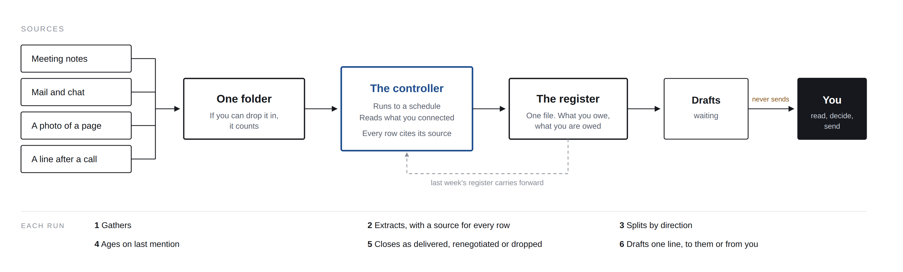

# The commitment register

*Companion kit for* ***So What, Now What*** *- Issue 05: "Nobody should have to report their own bad news."*

**What are you owed right now, by whom, and since when?**

Almost nobody can answer that completely, and the reason is not carelessness. The promises that run your week are made in meetings, on calls, in threads and in corridors. Hundreds a month, in both directions, and not one of them is in a system anywhere. No product can see the whole set, because each one owns a channel and your commitments cross all of them.

So this is a file rather than a subscription.

**One agent, one file, one folder.** Not a suite. A private register of commitments in both directions, that **ages on silence as well as on dates**, and **closes by recording which of three things happened**. Those three properties are the whole of it.

License: CC BY 4.0. Use it, adapt it, ship it inside your own work. A credit back to *So What, Now What* is appreciated, not required.

---

## What's here

- **[`register.md`](register.md)** - **the object, and the point.** The columns, the rules, and a worked example filled in. This is what you end up owning. The agent can be replaced tomorrow; this file cannot be taken away from you.
- **[`controller.skill.md`](controller.skill.md)** - the thing that keeps it current. A plain instruction file carrying the schedule, the folder, the capture threshold, the citation rule, the two directions, the silence bound, the three closings and the list of things it must never do. Install it as a skill, or paste it into any chat model. Nothing to edit.
- **[`SETUP.md`](SETUP.md)** - start here to run it. Ten minutes to a first run, the five dials you set, and what to check before you trust it.
- **[`EXAMPLE-run-output.md`](EXAMPLE-run-output.md)** - a full run against the demo folder: what it found, what it closed, **what it refused to turn into a row**, and the drafts left waiting. Read this before installing anything.
- **[`folder/`](folder/)** - the working folder. Ships with one messy month of a fictional operations job. Delete it and drop in your own.
- **[`CONNECT.md`](CONNECT.md)** - **where this is meant to end up.** The same loop reading your mail, files and calendar directly, so the weekly handling drops to nothing. Includes what to ask your administrator for, and the three things any assistant needs to be able to do.

## How it works

Each run, six things: **gathers** whatever is new · **extracts**, only where a person and a time are identifiable, citing the sentence every time · **splits by direction**, what you owe and what you are owed · **ages**, on last mention as well as on the dates that exist · **closes** as delivered, renegotiated or dropped · **drafts** one line, to them or from you, and leaves it where you already look.

Your job is what is left: reading what it found, and deciding what to do about it.

## Low touch, or it will not survive the month

**You do three things by hand, because no connector can see them.** A line after a phone call - who, what, by when. A photograph of a notebook page. Anything said in a room that produced no notes.

**Everything else is the controller's job**, and it is forbidden from pushing work back to you. It does not ask you to export a thread, tidy the folder, rename a file or confirm a row it could have decided.

It even shrinks the one habit. Reading your calendar, it notices the meetings and calls that produced no record anywhere and asks a single question in the weekly digest - *"Tuesday, 30 minutes with Ingrid, and nothing came out of it. Anything promised?"* One line back and it builds the rows.

**It looks every day and speaks rarely.** Most days it says nothing. Once a week you get the digest whether or not there is anything in it, and that empty line is what makes the silence on the other six days worth trusting.

**And it never raises the same thing twice.** Every row carries the date it was last put in front of you, and it does not come back until the row changes or the silence doubles. If you saw a draft and chose not to send it, that was a decision. This is the difference between a tool you keep and every nagging reminder you have already muted.

## Two triggers, both directions

|  | **Approaching** | **Gone quiet** |
|---|---|---|
| **What you owe** | A line ready to go, days early, before anybody has to ask. **The most useful message it produces.** | Surfaced to you only. Nothing drafted to anybody. |
| **What you are owed** | Nothing, by default. Chasing people who have not missed anything is how tools like this get a reputation. | The chase draft. One line, no accusation, easy to answer with "it slipped". |

Dates are table stakes and they have to work. **Silence is the finding**, and it is the half nothing else does.

## The three things nothing else does

**Both directions.** Every tool that captures commitments captures yours, because it can only see the ones addressed to its own user. The list of what you are *owed* is the one you have never had, and it will be longer than you expect.

**Silence as well as dates.** Reminders fire when a date passes, and most real commitments never had a date. A promise nobody has mentioned in a month does not trip a single alert in any system you own. Here, a fortnight of quiet is a finding in its own right.

**How it ended.** Commitments rarely fail outright. They get quietly renegotiated or quietly dropped, and neither is ever written down. Recording **which of the three** costs one column and is the entire argument of the issue in object form.

## The folder is the connector

The controller reads one place. That single choice is why this works with everything you already use, needs nobody's permission, and survives you changing tools.

**One rule: if you can drop it in, it counts.** A typed line, a note dictated on your phone, a photograph of a page from your notebook, a forwarded email, an exported thread.

That is the floor, and it needs nobody's permission. **It is not where you should stay** - exporting threads by hand every week is work, and you will stop doing it. [`CONNECT.md`](CONNECT.md) reads mail and files directly, and then the folder is only for the three things no connector can see.

## What it never does

It **does not send**. Every message waits for you, and when you send it, it is from you, in your words, and you answer for it. It never scores anybody, never shares the register, never touches your sources, and when it is unsure what was promised it says so rather than guessing.

**Two things do not turn, and everything depends on them:** it never creates a row it cannot trace to something somebody actually wrote, and it never sends. Everything else - what counts as a commitment, how long silence runs, how early a date is raised, how often it looks, and whether it ever pre-nudges - is a dial, and all five are yours.

## A good week produces nothing

Issue 4's agent produced something every time you ran it. This one is at its best when it produces nothing at all. If it is putting five things in front of you every Monday, the bounds are set wrong, and the bounds are yours. Start tighter than feels comfortable: **a tool that misses things and is trusted beats one that catches everything and gets ignored.**

## This is not a project tool

If work already sits in a system with a plan and an owner, leave it there. That is the best-governed work you have. This is for everything that never got that far.

## The 30-day move

Run it once, on last month, for yourself. Nobody needs to approve it and nobody needs to know. Then look only at what you are owed, and only by the people you find it expensive to chase. **Count the rows nobody has mentioned in a fortnight.**

That number is what you have been carrying without knowing it.

---

*You already know what you owe. The question is what you are owed, and whether you would rather not know.*

*Concepts, arguments, and voice are mine. Claude is used as an editing and scaffolding tool.*

*CC BY 4.0 · So What, Now What · github.com/brownfield-bridge/so-what-now-what*
