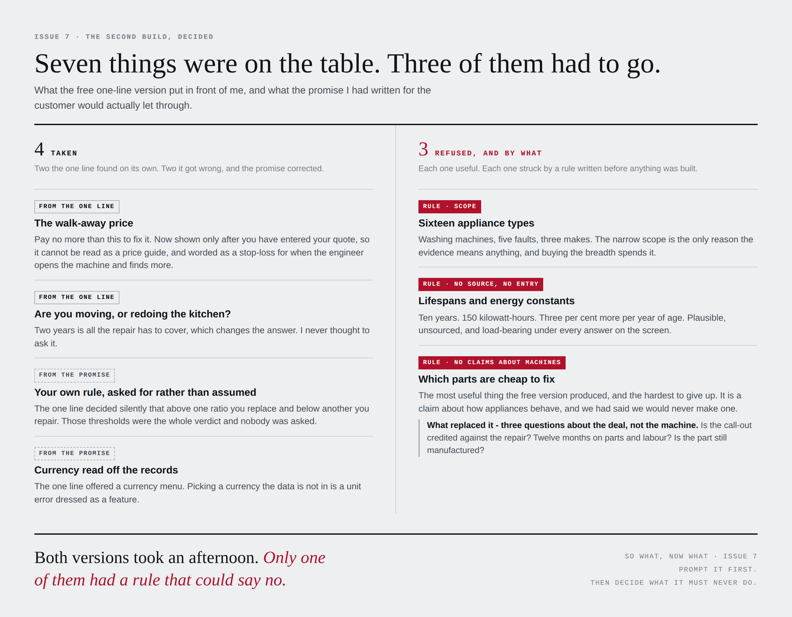

# What was taken, and what was refused

**Seven things were on the table. Three of them had to go.**

The free one-line version put a set of ideas in front of me. The promise written for the customer, and the six things the tool is never allowed to do, decided which of them survived.

---

## Taken - four

**Two the one line found on its own. Two it got wrong, and the promise corrected.**

### 1. The walk-away price · *from the one line*

Pay no more than this to fix it. **Re-shaped before it went in**, because a published ceiling is an anchor: a repairer who would have quoted €90, seeing the tool tell the customer *up to €280*, has been handed a reason to quote €280.

Three conditions, all of them build requirements:

- It appears **only after** the user has entered their quote. It cannot be read as a price guide if it cannot be seen until the price exists.
- It is worded as a **stop-loss during the job**, not a fair price before it.
- The screen says what it is not: *this is not an estimate of what the repair should cost.*

Build 2 went further than asked. With fewer than four write-offs in the matching set it refuses to give a walk-away figure at all: *"a stop-loss invented from two cases would be worse than none."*

### 2. Are you moving, or redoing the kitchen? · *from the one line*

Two years is all the repair has to cover, which changes the answer. **Nobody in two days of interviewing thought to ask it.**

### 3. Your own rule, asked for rather than assumed · *from the promise*

The one line decided silently that above one ratio you replace and below another you repair. Those thresholds were the whole verdict and nobody was asked.

Build 2 asks where your line sits and reads the forecast against it. *The forecast does not move. Only the line does.*

### 4. Currency read off the records · *from the promise*

The one line offered a currency menu - and switching currency silently overwrote whatever electricity price the user had typed. Picking a currency the data is not in is a unit error dressed as a feature.

---

## Refused - three

**Each one useful. Each one struck by a rule written before anything was built.**

### Sixteen appliance types
**Rule: scope.**
Washing machines, five faults, three makes. The narrow scope is the only reason the evidence means anything, and buying the breadth spends it. Taking it would have cost the dependency field and dropped the score.

### Lifespans and energy constants
**Rule: no source, no entry.**
Ten years. 150 kilowatt-hours. Three per cent more per year of age. €0.29 a kilowatt-hour. Plausible, unsourced, and load-bearing under every answer on the screen.

**The honest half survives.** Build 2 shows the declared energy figure for the machine *you* are considering, typed off *your* label, and shows what your old machine draws as **UNKNOWN** - because it is. It will not guess it from the age.

### Which parts are cheap to fix
**Rule: no claims about how machines behave.**
*"Brushes and belts are cheap, drum bearings are not."* The most useful single thing the free version produced, and the hardest to give up.

**It splits, and half of it is admissible.** Claims about machines are barred. Questions about the transaction are not. So what replaced it:

> Before you agree to the job: is the call-out fee credited against the repair; does the repair carry twelve months on parts and labour; is the part still manufactured?

Process, not product behaviour. Useful, and it survives the rule intact.

---

## Why this page matters more than the rest of the kit

Every other page here is a claim about what rules do. **This is what they actually did, on material they did not produce, with the reason for each decision written down before the decision was made.**

It is also the page that shows the cost. Three good ideas were refused. The tool is narrower and less immediately useful than the free version because of it. That trade is the whole argument, and it should be visible rather than asserted.

> **Both versions took an afternoon. Only one of them had a rule that could say no.**
